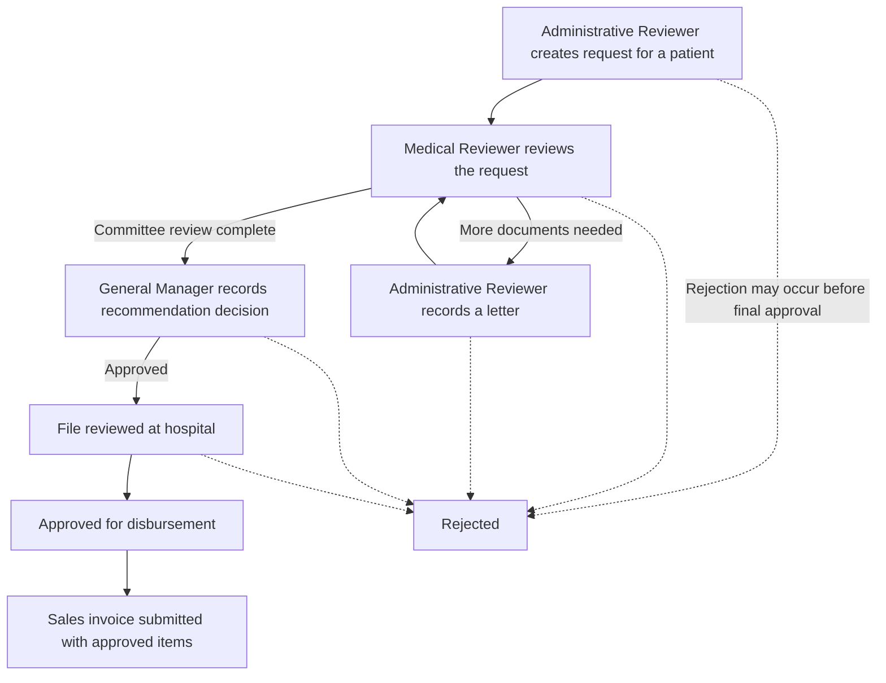

# state_treatment

Frappe app for state-funded treatment recommendations. Target versions: Frappe Framework v15.117.0, ERPNext v15.97.0, and Healthcare v15.2.1.

## Install

```bash
bench --site [site-name] install-app state_treatment
bench restart
```

The restricted protocol master data is intentionally excluded from Git. Installation does not require it. An authorized administrator must provision the JSON file on the server and import it explicitly after installation:

```bash
bench --site [site-name] execute state_treatment.patches.v1_0.import_breast_cancer_protocols.execute --kwargs '{"file_path":"/secure/path/breast_cancer_protocols.json"}'
```

The default file path is `state_treatment/data/breast_cancer_protocols.json`, which is ignored by Git. Do not commit the source data or patient records to this public repository.

The app provides the State Treatment Recommendation, Recommendation Protocol Item, and Administrative Letter DocTypes; recommendation workflow and official print format fixtures; and Sales Invoice submission validation against approved recommendations. The linked Healthcare Service Unit DocType and Patient DocType must be available from the installed Healthcare app.

## How It Works

The app gives staff a shared case file for a state-funded treatment request. It records the request, tracks its review and approval stages, and helps ensure that a submitted sales invoice is tied to an approved recommendation. It supports administrative review; it does not choose treatment or make clinical decisions.



## User Roles

- **Administrative Reviewer:** Starts a request for an existing patient, enters its details, and records administrative letters when more documents are needed.
- **Medical Reviewer:** Reviews the request at the committee stage and resumes the review when requested information is added.
- **General Manager:** Records the recommendation decision and advances approved cases through hospital-file review and disbursement approval.

There is no separate Hospital role in this release; the hospital-file review is a workflow step handled by the General Manager role.

## Requests and Invoices

- Treatment items, codes, durations, and prices are selected from the protocol catalog. An authorized administrator must securely import the catalog before staff can use those options.
- A sales invoice may be prepared earlier, but it can only be submitted when it is linked to an approved recommendation and contains items allowed by that recommendation.
- The app includes a printable request form. Before production use, verify that its layout matches the official form on the target site.

## Using the System Step by Step

Before starting, sign in with the role assigned to your part of the process. The patient must already exist in Healthcare, and the administrator must have imported the authorized treatment catalog and set up its State-funded price list.

1. **Create the request:** As an Administrative Reviewer, open **State Treatment Recommendation**, create a new record, select the patient, and enter the available recommendation, council, facility, date, and reviewer details. Add each treatment protocol item and check the automatically populated item information and total. Save the record; it starts in **Draft**.
2. **Send it for committee review:** A Medical Reviewer opens the saved recommendation and chooses **Submit for Committee Review**. The status changes to **Under Committee Review**.
3. **Request missing documents, if needed:** A Medical Reviewer chooses **Request Administrative Letter**. As an Administrative Reviewer, create an **Administrative Letter**, link it to the recommendation, and enter the request number, committee date, letter text, recipient facility, and issue date. After recording the requested information, the Medical Reviewer reopens the recommendation and chooses **Resume Review**.
4. **Record the committee decision:** Once review is complete, the General Manager opens the recommendation and chooses **Approve Recommendation**. If it cannot proceed, the General Manager can choose **Reject** at an available stage before disbursement approval.
5. **Complete the remaining approvals:** For an approved recommendation, the General Manager chooses **Review File at Hospital** after the hospital-file review is complete, then chooses **Approve for Disbursement** when ready. The recommendation status shows the current stage throughout.
6. **Prepare and submit the invoice:** Create a Sales Invoice and link it to the recommendation using the **State Treatment Recommendation** field. Add only the protocol items listed on that recommendation. A draft invoice can be prepared earlier, but submission is allowed only after the recommendation reaches **Approved for Disbursement**.
7. **Print the request when needed:** Open the recommendation and use the standard Print action to produce its printable form. Check the printed result against the official form before using it operationally.

If an expected workflow action is missing, check that you are signed in with the role allowed to perform that transition and that the recommendation is currently at the correct stage. Contact the system administrator if the patient, treatment catalog, or required price list is unavailable.

