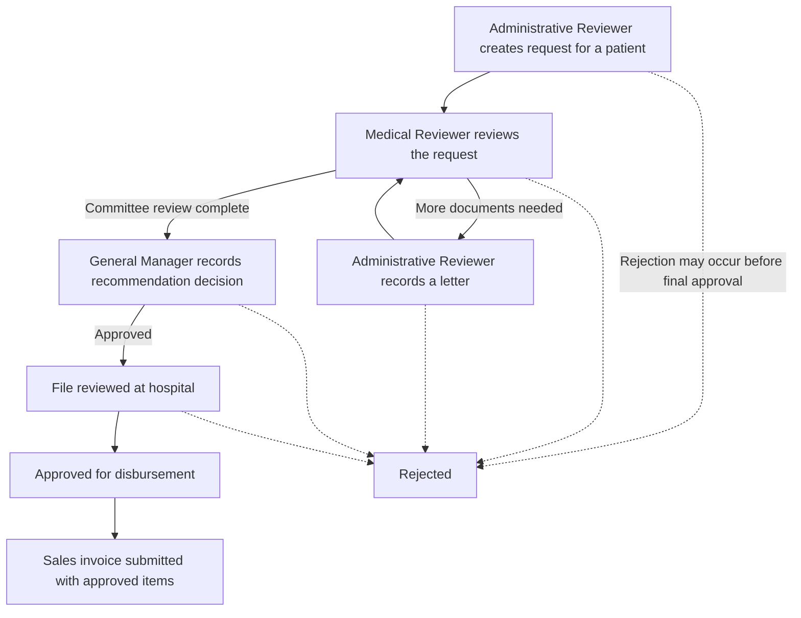

# state_treatment

Frappe app for state-funded treatment recommendations. Target versions: Frappe Framework v15.117.0, ERPNext v15.97.0, and Healthcare v15.2.1.

## Install

```bash
bench --site [site-name] install-app state_treatment
bench restart
```

The restricted protocol master data is intentionally excluded from Git. Installation does not require it. An authorized administrator must provision the JSON file on the server and import it explicitly after installation:

```bash
bench --site [site-name] execute state_treatment.patches.v1_0.import_breast_cancer_protocols.execute --kwargs '{"file_path":"/secure/path/breast_cancer_protocols.json"}'
```

The default file path is `state_treatment/data/breast_cancer_protocols.json`, which is ignored by Git. Do not commit the source data or patient records to this public repository.

The app provides the State Treatment Recommendation, Recommendation Protocol Item, and Administrative Letter DocTypes; recommendation workflow and official print format fixtures; and Sales Invoice submission validation against approved recommendations. The linked Healthcare Service Unit DocType and Patient DocType must be available from the installed Healthcare app.

## How It Works

The app gives staff a shared case file for a state-funded treatment request. It records the request, tracks its review and approval stages, and helps ensure that a submitted sales invoice is tied to an approved recommendation. It supports administrative review; it does not choose treatment or make clinical decisions.



## User Roles

- **Administrative Reviewer:** Starts a request for an existing patient, enters its details, and records administrative letters when more documents are needed.
- **Medical Reviewer:** Reviews the request at the committee stage and resumes the review when requested information is added.
- **General Manager:** Records the recommendation decision and advances approved cases through hospital-file review and disbursement approval.

There is no separate Hospital role in this release; the hospital-file review is a workflow step handled by the General Manager role.

## Requests and Invoices

- Treatment items, codes, durations, and prices are selected from the protocol catalog. An authorized administrator must securely import the catalog before staff can use those options.
- A sales invoice may be prepared earlier, but it can only be submitted when it is linked to an approved recommendation and contains items allowed by that recommendation.
- The app includes a printable request form. Before production use, verify that its layout matches the official form on the target site.

