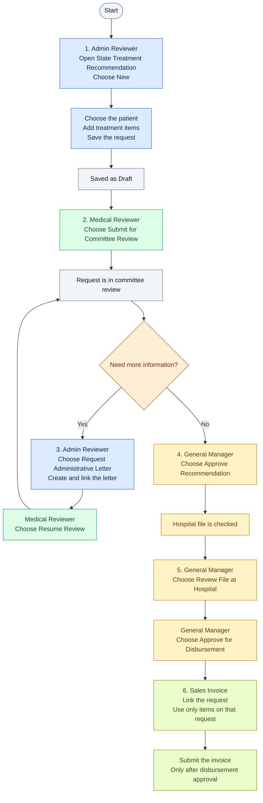

# State Treatment

State Treatment helps a healthcare team manage requests for state-funded treatment in one place. Staff can record a request, follow it through review and approval, print its form, and link a Sales Invoice to the approved treatment items.

**It supports the administrative process; it does not recommend or decide medical treatment.**

## Who Does What

- **Administrative Reviewer:** Creates the request for an existing patient, fills in its details, and records administrative letters when more information is needed.
- **Medical Reviewer:** Reviews requests at the committee stage and resumes review after requested information is recorded.
- **General Manager:** Makes the recommendation decision and moves approved requests through hospital-file review and disbursement approval.

In this release, hospital-file review is a step completed by the General Manager; there is no separate Hospital role.

## Using the System

Before you begin, make sure the patient already exists in Healthcare and the system administrator has loaded the treatment catalog and its prices. Sign in with the role assigned to you. You will only see actions available to your role and the request's current stage.

### Workflow Graph



At certain stages before disbursement approval, the General Manager can choose **Reject** instead. A draft invoice may be prepared earlier, but do not submit it until the request is approved for disbursement.

1. **Start a request.** Open **State Treatment Recommendation** and create a new request. Select the patient, enter the available recommendation, council, facility, date, and reviewer details, then add the treatment items. The item details and total are filled in from the catalog. Save the request; its first status is **Draft**.
2. **Send it to committee review.** A Medical Reviewer opens the saved request and selects **Submit for Committee Review**. Its status becomes **Under Committee Review**.
3. **Handle missing information.** If more information is needed, an Administrative Reviewer selects **Request Administrative Letter**, then creates an **Administrative Letter**, links it to the request, and fills in the requested details. The Medical Reviewer then reopens the request and selects **Resume Review**.
4. **Record the decision.** When committee review is complete, the General Manager opens the request and selects **Approve Recommendation**. The General Manager may select **Reject** instead when rejection is available.
5. **Finish the approval steps.** After the hospital-file review is complete, the General Manager selects **Review File at Hospital**. When ready, select **Approve for Disbursement**. The request status shows how far it has progressed.
6. **Print the request, if needed.** Open the request and use **Print**. Check the printed form against the official form before using it operationally.
7. **Prepare and submit an invoice.** Create a Sales Invoice and link it to the request using **State Treatment Recommendation**. Add only items listed on that request. You may prepare a draft invoice earlier, but it cannot be submitted until the request status is **Approved for Disbursement**.

### If You Cannot Find an Action

Check that you are signed in with the right role and that the request is at the correct stage. If a patient, treatment item, or price is missing, contact your system administrator.

## For System Administrators

### Prerequisites

**Yes, Healthcare is required.** Before installing State Treatment, install these platform apps on the same Frappe site, in this order:

1. Frappe Framework **v15.117.0**
2. ERPNext **v15.97.0**
3. Healthcare **v15.2.1**

State Treatment is the app documented in this repository, not a prerequisite. Install it after the three platform apps using the command below.

Before staff begin processing requests, make sure that:

- Healthcare is installed and contains the patients who will be selected on requests. The **Patient** record is required for each request.
- The relevant **Healthcare Service Unit** records exist for facilities selected on requests and administrative letters.
- The authorized treatment catalog JSON file is available securely on the server and has been imported, creating the protocol items and their State-funded EGP prices. Do not put this restricted file in the public repository.
- Staff have user accounts and have been assigned the appropriate **Admin Reviewer**, **Medical Reviewer**, or **General Manager** role. A System Manager can administer setup.
- The ERPNext site is configured for the organization, including the company and any standard customer, accounting, and tax details needed to create its Sales Invoices.

The catalog import creates the State-funded selling price list in EGP and the protocol items/prices. If catalog data or prices are unavailable, users will not be able to add treatment items to requests.

### Install

```bash
bench --site [site-name] install-app state_treatment
bench restart
```

### Load the Treatment Catalog

The treatment catalog is restricted data and is intentionally not included in this public repository. Installation does not load it. An authorized administrator must securely provision the JSON file on the server and import it after installation:

```bash
bench --site [site-name] execute state_treatment.patches.v1_0.import_breast_cancer_protocols.execute --kwargs '{"file_path":"/secure/path/breast_cancer_protocols.json"}'
```

The default file path is `state_treatment/data/breast_cancer_protocols.json`; that file is ignored by Git. The catalog and patient records must not be committed to this repository. The administrator must also configure the State-funded price list. Without the catalog and prices, staff cannot add protocol items to requests.

## What the App Includes

- A request record with a tracked approval workflow.
- Administrative letters linked to requests.
- A printable request form. Confirm its layout matches the official form on the target site before production use.
- A Sales Invoice check that requires an approved-for-disbursement request and limits invoice items to those on that request.

